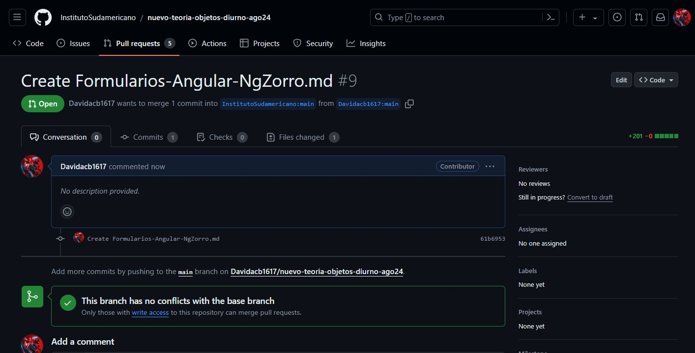
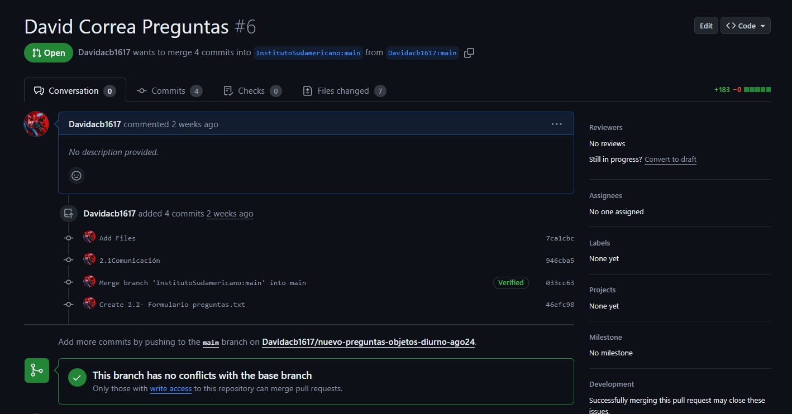

# Formularios en Angular con Ng-zorro

### Nathaly Caballero: https://youtu.be/S_QTBHTMlF0

### David Correa: https://youtu.be/dfpWtfheBGg

## 1. Introducción

Ng-zorro es una biblioteca de componentes UI basada en Ant-design para Angular. Facilita la creación de interfaces de usuario atractivas y funcionales. En el contexto de formularios, Ng-zorro proporciona una variedad de componentes que hacen que la creación y gestión de formularios sea más sencilla y estéticamente agradable.

> **Reflexión**: ¿Cómo puede la utilización de bibliotecas de componentes UI como Ng-zorro mejorar la productividad y la calidad de las interfaces de usuario en aplicaciones Angular?

## 2. Instalación y Configuración de Ng-zorro

### Instalación

Para empezar a usar Ng-zorro, primero se debe instalar la biblioteca en el proyecto Angular:

```bash
ng add ng-zorro-antd
```

### Configuración

Ng-zorro se puede configurar para que utilice un tema específico. Esto se hace en el archivo `angular.json`:

```json
{
  "styles": ["node_modules/ng-zorro-antd/ng-zorro-antd.css", "src/styles.css"]
}
```

Luego, en el módulo principal (`app.module.ts`), se importa el módulo Ng-zorro:

```typescript
import { NgZorroAntdModule } from 'ng-zorro-antd';

@NgModule({
  imports: [
    NgZorroAntdModule,
    // otros módulos
  ],
  // demás configuración
})
export class AppModule {}
```

> **Reflexión**: La facilidad de instalación y configuración de bibliotecas como Ng-zorro permite a los desarrolladores enfocarse más en la lógica de negocio y menos en el diseño UI. ¿Cómo puede esto impactar en el tiempo de desarrollo y la calidad del producto final?

## 3. Creación de Formularios con Ng-zorro

### Formulario Reactivo

Angular ofrece dos enfoques para manejar formularios: formularios reactivos y formularios dirigidos por plantilla. A continuación, se muestra cómo crear un formulario reactivo utilizando Ng-zorro.

1. **Formulario Reactivo con Ng-zorro**:

   - **HTML (`app.component.html`)**:

   ```html
   <form
     [formGroup]="validateForm"
     (ngSubmit)="submitForm()"
   >
     <nz-form-item>
       <nz-form-label
         [nzSm]="6"
         [nzXs]="24"
         nzFor="email"
         >Email</nz-form-label
       >
       <nz-form-control
         [nzSm]="14"
         [nzXs]="24"
         nzHasFeedback
         nzValidateStatus="email"
       >
         <input
           nz-input
           formControlName="email"
           id="email"
         />
         <nz-form-explain
           *ngIf="validateForm.get('email').dirty && validateForm.get('email').errors"
         >
           Please input your email!
         </nz-form-explain>
       </nz-form-control>
     </nz-form-item>
     <nz-form-item>
       <nz-form-label
         [nzSm]="6"
         [nzXs]="24"
         nzFor="password"
         >Password</nz-form-label
       >
       <nz-form-control
         [nzSm]="14"
         [nzXs]="24"
         nzHasFeedback
         nzValidateStatus="password"
       >
         <input
           nz-input
           type="password"
           formControlName="password"
           id="password"
         />
         <nz-form-explain
           *ngIf="validateForm.get('password').dirty && validateForm.get('password').errors"
         >
           Please input your password!
         </nz-form-explain>
       </nz-form-control>
     </nz-form-item>
     <button
       nz-button
       nzType="primary"
       [disabled]="!validateForm.valid"
     >
       Submit
     </button>
   </form>
   ```

   - **TypeScript (`app.component.ts`)**:

   ```typescript
   import { Component, OnInit } from '@angular/core';
   import { FormBuilder, FormGroup, Validators } from '@angular/forms';

   @Component({
     selector: 'app-root',
     templateUrl: './app.component.html',
   })
   export class AppComponent implements OnInit {
     validateForm!: FormGroup;

     constructor(private fb: FormBuilder) {}

     ngOnInit(): void {
       this.validateForm = this.fb.group({
         email: [null, [Validators.email, Validators.required]],
         password: [null, [Validators.required]],
       });
     }

     submitForm(): void {
       if (this.validateForm.valid) {
         console.log('submit', this.validateForm.value);
       } else {
         Object.values(this.validateForm.controls).forEach((control) => {
           if (control.invalid) {
             control.markAsDirty();
             control.updateValueAndValidity();
           }
         });
       }
     }
   }
   ```

> **Reflexión**: La integración de formularios reactivos con componentes de Ng-zorro proporciona una experiencia de usuario más coherente y validaciones más robustas. ¿Cómo puede esto afectar la usabilidad y confiabilidad de una aplicación web?

## 4. Validación y Feedback Visual

Ng-zorro ofrece varios componentes y directivas para proporcionar feedback visual en los formularios, mejorando la experiencia del usuario.

### Feedback Visual

- **nz-form-explain**: Se utiliza para mostrar mensajes de error o advertencias.
- **nzHasFeedback** y **nzValidateStatus**: Se usan para mostrar estados de validación como éxito, advertencia o error.

> **Reflexión**: El feedback visual inmediato en formularios mejora la interacción del usuario y reduce errores. ¿Cómo puede esto influir en la satisfacción del usuario y la eficacia de los formularios?

## 5. Temas y Personalización

Ng-zorro permite una gran personalización a través de sus temas. Puedes personalizar el estilo de tus componentes para que se adapten a la identidad visual de tu aplicación.

### Personalización

- **Configuración de Variables de Tema**: Puedes personalizar las variables del tema en el archivo `angular.json` o en un archivo de estilos global.
- **Uso de Preprocesadores CSS**: Ng-zorro soporta Less y Sass, permitiendo una personalización más avanzada.

> **Reflexión**: La capacidad de personalizar y tematizar los componentes UI es crucial para mantener una identidad visual coherente. ¿Cómo puede esto influir en la percepción de marca y la profesionalidad de una aplicación?

## Resumen

| Aspecto                 | Detalles                                                                                       |
| ----------------------- | ---------------------------------------------------------------------------------------------- |
| **Instalación**         | Uso del comando `ng add ng-zorro-antd` para instalar la biblioteca en un proyecto Angular.     |
| **Configuración**       | Importar y configurar Ng-zorro en el módulo principal y el archivo `angular.json`.             |
| **Formulario Reactivo** | Uso de Ng-zorro para crear y manejar formularios reactivos con validación robusta.             |
| **Feedback Visual**     | Implementación de componentes y directivas de Ng-zorro para proporcionar feedback visual.      |
| **Personalización**     | Configuración de temas y personalización avanzada usando preprocesadores CSS como Less y Sass. |

Ng-zorro proporciona una manera elegante y eficiente de manejar formularios en Angular, mejorando tanto la experiencia del desarrollador como la del usuario final. La integración de componentes UI bien diseñados y personalizables facilita la creación de aplicaciones web profesionales y funcionales.

## Referencias

- Team, N. (s. f.). NG-ZORRO - Angular UI component library. NG-ZORRO - Ant Design Of Angular. https://ng.ant.design/docs/introduce/en
- Senthil, P. (2023, 19 junio). Mastering Angular UI: Unlocking the Power of Ng Zorro. Medium. https://medium.com/@priyadharshansenthil/mastering-angular-ui-unlocking-the-power-of-ng-zorro-d5b8af955a9b
- Studocu. (s. f.). Angular y NG- Zorro - { Nombre: Clemente Eduardo Vasquez Reyes Carrera: Ing. Informática Asignatura: - StudoCU. https://www.studocu.com/es-mx/document/universidad-del-valle-de-mexico/programacion/angular-y-ng-zorro/28385204

### Pull Request



